# Component Dependencies

---

## Layer Dependency Graph

```mermaid
flowchart TD
    subgraph L1["L1 API"]
        CR["ConversationRouter"]
        MIR["MemoryInspectionRouter"]
        MMR["MemoryManagementRouter"]
        IR["ImportRouter"]
        DMR["DataManagementRouter"]
        HR["HealthRouter"]
    end

    subgraph L2["L2 Orchestration"]
        INT["IntentRouter"]
        CW["ConversationWorkflow"]
        EW["ExtractionWorkflow"]
        CORW["CorrectionWorkflow"]
        HAW["HistoricalAnalysisWorkflow"]
        CLW["ClarificationWorkflow"]
        CP["WorkflowCheckpointer"]
    end

    subgraph L3["L3 Domain Services"]
        CS["ConversationService"]
        EC["ExtractionCoordinator"]
        ES["ExtractionService"]
        MS["MemoryService"]
        CDS["ConflictDetectionService"]
        RS["RetrievalService"]
        BG["BudgetGovernor"]
        CAS["ContextAssemblyService"]
        TS["TimelineService"]
        BHS["BeliefHistoryService"]
        ENS["EntityService"]
        PS["ProvenanceService"]
        DS["DeletionService"]
        RIS["ReindexService"]
        IMS["ImportService"]
        EXS["ExportService"]
        BS["BackupService"]
    end

    subgraph L4["L4 Ports"]
        MGP["MemoryGraphPort"]
        LLP["LLMProviderPort"]
        RSP["RelationalStorePort"]
        OSP["ObjectStorePort"]
        CLP["ClockPort"]
    end

    subgraph L5["L5 Adapters"]
        GMA["GraphitiMemoryAdapter"]
        GPA["GeminiProviderAdapter"]
        PSA["PostgresStoreAdapter"]
        LFA["LocalFileStoreAdapter"]
        SCA["SystemClockAdapter"]
    end

    subgraph L6["L6 Infrastructure"]
        NEO["Neo4j 5.26+"]
        PG["PostgreSQL"]
        FS["Filesystem"]
        GEM["Gemini API"]
    end

    CR --> INT
    CR --> CW
    CR --> EC
    CR --> CS
    MIR --> RS
    MIR --> TS
    MIR --> BHS
    MIR --> ENS
    MIR --> PS
    MMR --> CORW
    MMR --> DS
    MMR --> MS
    IR --> IMS
    DMR --> EXS
    DMR --> BS
    DMR --> RIS

    INT --> LLP
    CW --> RS
    CW --> CAS
    CW --> LLP
    EW --> ES
    EW --> CDS
    EW --> MS
    EW --> ENS
    EW --> BHS
    CORW --> PS
    CORW --> MS
    CORW --> BHS
    HAW --> TS
    HAW --> BHS
    HAW --> RS
    HAW --> CAS
    CLW --> PS
    CLW --> MS
    CLW --> CP
    CP --> RSP

    CS --> RSP
    EC --> RSP
    ES --> LLP
    MS --> RSP
    MS --> MGP
    MS --> CLP
    CDS --> RS
    CDS --> LLP
    RS --> MGP
    RS --> BG
    CAS --> PS
    TS --> MGP
    TS --> RSP
    BHS --> RSP
    ENS --> MGP
    PS --> RSP
    DS --> RSP
    DS --> MGP
    RIS --> RSP
    RIS --> MGP
    IMS --> OSP
    IMS --> RSP
    EXS --> OSP
    BS --> OSP

    MGP --> GMA
    LLP --> GPA
    RSP --> PSA
    OSP --> LFA
    CLP --> SCA

    GMA --> NEO
    GMA --> GEM
    GPA --> GEM
    PSA --> PG
    LFA --> FS

    style L1 fill:#BBDEFB,stroke:#1565C0
    style L2 fill:#C8E6C9,stroke:#2E7D32
    style L3 fill:#FFF9C4,stroke:#F9A825
    style L4 fill:#F8BBD0,stroke:#C2185B
    style L5 fill:#D1C4E9,stroke:#5E35B1
    style L6 fill:#CFD8DC,stroke:#455A64
```



**Note**: `GraphitiMemoryAdapter` depends on the Gemini API directly, not through `LLMProviderPort`. This is intentional per ADR-007 — Graphiti manages its own provider clients. Routing Graphiti's internal calls through our port would mean fighting the framework.

---

## Dependency Matrix

Rows depend on columns. `P` = via port, `D` = direct.

| Component | RSP | MGP | LLP | OSP | CLP | Other services |
|---|---|---|---|---|---|---|
| ConversationService | P | — | — | — | P | — |
| ExtractionCoordinator | P | — | — | — | P | — |
| ExtractionService | — | — | P | — | P | — |
| MemoryService | P | P | — | — | P | ProvenanceService |
| ConflictDetectionService | — | — | P | — | P | RetrievalService |
| RetrievalService | — | P | — | — | P | BudgetGovernor |
| BudgetGovernor | — | — | — | — | P | — |
| ContextAssemblyService | — | — | — | — | P | ProvenanceService |
| TimelineService | P | P | — | — | P | — |
| BeliefHistoryService | P | — | — | — | P | — |
| EntityService | — | P | — | — | P | — |
| ProvenanceService | P | — | — | — | — | — |
| DeletionService | P | P | — | — | P | MemoryOperationLog |
| ReindexService | P | P | — | — | P | ExtractionService |
| ImportService | P | — | — | P | P | ExtractionCoordinator |
| ExportService | P | P | — | P | — | — |
| BackupService | P | — | — | P | P | — |

Every dependency is either a port or another L3 service. No L3 component appears with a `D` against infrastructure — that is the invariant to check in review.

---

## Cross-Cutting Access

These are available to all layers and are excluded from the layering rules.

| Component | Consumers |
|---|---|
| ConfigurationManager | All (read at startup) |
| ObservabilityKit | All |
| DegradationPolicy | L2 workflows, RetrievalService, ExtractionCoordinator |
| MemoryOperationLog | MemoryService, DeletionService, EntityService, CorrectionWorkflow |
| ClockPort | Any component producing a timestamp |

---

## Data Flow — Storage Ownership

```text
                     ┌──────────────────────────────────┐
   user message ────► │  PostgreSQL  (system of record)  │
                     │                                  │
                     │  conversations                   │
                     │  messages          append-only   │
                     │  documents                       │
                     │  episodes          replay source │
                     │  extraction_status durable barrier│
                     │  memory_operations audit          │
                     │  belief_history    what/when      │
                     │  provenance_index                 │
                     │  workflow_checkpoints (LangGraph) │
                     │  schema_migrations                │
                     └───────────────┬──────────────────┘
                                     │  replay episodes
                                     ▼
                     ┌──────────────────────────────────┐
                     │  Neo4j via Graphiti (projection) │
                     │                                  │
                     │  entity nodes                    │
                     │  relationship edges              │
                     │  temporal fact edges             │
                     │  episode nodes                   │
                     │  embeddings + fulltext indices   │
                     └──────────────────────────────────┘
                              rebuildable, not authoritative
```

The arrow only points one way. Nothing originates in Neo4j. That property is what makes `clear_all` and `rebuild` safe operations rather than data loss.

---

## Communication Patterns

| Pattern | Where | Why |
|---|---|---|
| Direct async call | Within a layer boundary, L1→L2→L3→L4 | Modular monolith; no network hop needed |
| Background task | `ExtractionCoordinator` → `ExtractionWorkflow` | Keeps extraction off the response path (ADR-008) |
| Concurrent fan-out / fuse | `RetrievalService` → four `MemoryGraphPort` searches | Latency budget |
| Streaming iterator | L2 workflows → L1 → SSE to client | FR-01.2 |
| Checkpoint / resume | `ClarificationWorkflow` ↔ PostgreSQL | Resumable interrupts (ADR-006) |
| Durable queue via table | `extraction_status` rows | Crash recovery without adding a broker |

**No message broker.** NFR-05.2 forbids unjustified infrastructure. A PostgreSQL table plus in-process tasks covers the single-user workload; adding Redis or Kafka here would be exactly the premature infrastructure the requirements warn against.

---

## Boundary Rules to Enforce in Review

| # | Rule | Detects |
|---|---|---|
| 1 | No `graphiti_core` import outside `GraphitiMemoryAdapter` | Framework leak; breaks ADR-001 swap path |
| 2 | No `langgraph` import outside L2 | Orchestration leak; breaks ADR-006 exit option |
| 3 | No `sqlalchemy` import in L3 | SQL leaking into domain logic |
| 4 | No `datetime.now()` anywhere; use `ClockPort` | Untestable temporal behavior |
| 5 | No `metadata.create_all()` | Violates ADR-004/009 schema authority |
| 6 | No `openai` dependency anywhere | Violates constraint C-2 |
| 7 | L3 constructor params are ports or L3 services only | Layering violation |

**Enforcement**: review discipline, not automation. A CI import linter was considered and dropped at the user's direction, since it does not affect functionality. Rule 6 is effectively self-enforcing — the `openai` package is simply never added as a dependency. Rules 1 and 2 protect the framework-swap path in ADR-001 and ADR-006, so they are worth checking deliberately during review of Units 3 and 5.

---

## Startup Sequence

Order matters; each step can fail the boot deliberately.

```text
1. ConfigurationManager.load()        → fail fast on missing GOOGLE_API_KEY / DB URLs
2. MigrationRunner.verify_checksums() → fail on altered applied migration
3. MigrationRunner.apply_pending()    → transactional
4. SchemaDriftCheck.assert_matches()  → fail on metadata/schema mismatch
5. Neo4j connectivity + version check → fail if < 5.26 (ADR-003)
6. Graphiti index initialization      → idempotent
7. ExtractionCoordinator.recover_pending() → re-queue crashed episodes
8. Serve
```

Step 5 is explicit because a wrong Neo4j version fails at first query with an opaque error rather than at boot. Checking the version up front turns a confusing runtime failure into a clear startup message.
