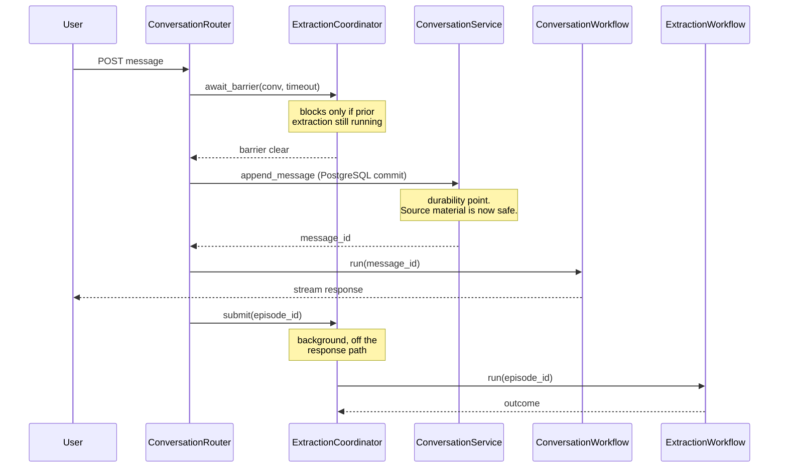
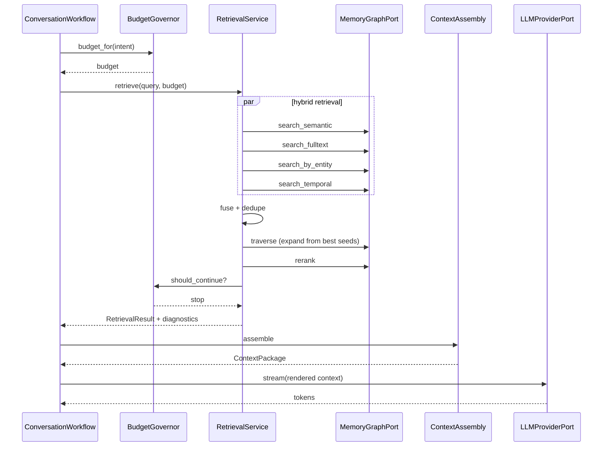

# Services and Orchestration Patterns

How the components coordinate. Five workflows, two critical paths, and the rules that keep them correct.

---

## Service Composition

Services are composed at application startup and injected. No service constructs its own dependencies.

```text
Composition root
  ├── adapters      (Graphiti, Gemini, Postgres, files, clock)
  ├── ports         ← bound to adapters
  ├── services      ← receive ports
  ├── workflows     ← receive services
  └── routers       ← receive workflows
```

Consequence: every service is testable with fake ports, including temporal behavior via a scripted `ClockPort`.

---

## Critical Path 1 — Write (message to memory)

This is the path that determines whether the product hypothesis holds.



### Rules on this path

1. **PostgreSQL commit precedes everything else.** The message is durable before any LLM call happens. If Gemini is down, the user's words are still recorded.
2. **The barrier is checked before append, not after.** Otherwise message N+1 could be extracted before message N.
3. **Extraction failure never fails the response.** It is recorded, retried, and surfaced through health and degradation notices.
4. **Episode payload is persisted before ingestion.** Reindex (ADR-005) replays from this record, so it must exist independently of Graphiti's success.

---

## Critical Path 2 — Read (question to answer)



### Rules on this path

1. **The four retrieval strategies run concurrently**, then fuse. Running them in sequence would burn the latency budget on coordination rather than search.
2. **Graph traversal is seeded by the fused results**, not run blind. Traversing from a bad seed is how irrelevant context floods the package (FR-06.5).
3. **Reranking happens after fusion, before assembly.** Reranking a single strategy's output wastes the cross-encoder.
4. **The governor decides when to stop.** FR-06.3 asks for the smallest useful set; that requires an explicit stop condition, not a fixed `limit`.
5. **Retrieval diagnostics always travel with results.** Without them a 30s budget cannot be tuned, and NFR-05.6 observability is unmet.

---

## Workflow 1 — Normal Conversation

| Node | Service call | Notes |
|---|---|---|
| classify | `IntentRouter.classify` | Low confidence routes to clarification |
| retrieve | `RetrievalService.retrieve` | Budget from governor |
| assemble | `ContextAssemblyService.assemble` | Four-way split preserved |
| generate | `LLMProviderPort.stream` | Streams to client |

Degradation: if `retrieve` raises, `DegradationPolicy.on_retrieval_failure` returns a fallback that proceeds with conversation-only context plus a disclosure notice. The user is told the answer may lack history rather than being given a confident answer built on nothing.

---

## Workflow 2 — Extraction (background)

| Node | Service call |
|---|---|
| load episode | `RelationalStorePort` |
| extract candidates | `ExtractionService.extract` |
| resolve entities | `EntityService.resolve` |
| retrieve related | `RetrievalService.retrieve` (entity-scoped) |
| detect conflicts | `ConflictDetectionService.detect` |
| branch | on conflict classification |
| commit | `MemoryService.commit` |
| record belief | `BeliefHistoryService.record` |
| log operation | `MemoryOperationLog.record` |

### Conflict branching

| Classification | Action |
|---|---|
| `AGREEMENT` | Reinforce existing fact; no new record |
| `REFINEMENT` | Attach detail to existing fact |
| `TEMPORAL_CHANGE` | Supersede with `effective_from`; both states retained (FR-04.4) |
| `CONTRADICTION` | Commit as uncertain, flag for surfacing (FR-05.6). Do not choose a winner. |

The last row is the one that matters most. Silently picking a version is the failure mode specification section 19 explicitly forbids.

---

## Workflow 3 — Correction

| Node | Service call |
|---|---|
| identify affected | `RetrievalService` + `ProvenanceService.chain` |
| fetch source | `ProvenanceService.source_excerpt` |
| compute correction | `LLMProviderPort.structured` |
| confirm scope | interrupt if more than one memory is affected |
| apply | `MemoryService.correct` |
| record belief transition | `BeliefHistoryService.record` |
| log | `MemoryOperationLog.record` |

**Correct vs supersede.** Both are reachable from a user saying something changed, and they are not interchangeable:

| User says | Operation | Effect on history |
|---|---|---|
| "That's not what I said" | `correct` | Original belief marked as mistaken; `BeliefWindow.retracted_at` set; world-time validity unchanged |
| "She moved in March" | `supersede` | Prior fact stays true for its window; new fact valid from March |

Choosing wrong corrupts the timeline in a way that is hard to detect later, so the workflow confirms rather than infers when the signal is weak.

---

## Workflow 4 — Historical Analysis

| Node | Service call |
|---|---|
| resolve time range | `LLMProviderPort.structured` → explicit window |
| retrieve in range | `RetrievalService.retrieve` with temporal filter |
| reconstruct | `TimelineService.reconstruct` |
| compute change | `TimelineService.diff` |
| assemble | `ContextAssemblyService.assemble` |
| generate | `LLMProviderPort.stream` |

Routes to `BeliefHistoryService.believed_at` instead of `TimelineService.state_at` when the question is about past belief ("what did I think") rather than past reality ("what was true"). Distinguishing these two is a routing decision, and getting it wrong produces a confidently wrong answer.

---

## Workflow 5 — Clarification (interrupting)

| Node | Service call |
|---|---|
| characterize ambiguity | `LLMProviderPort.structured` |
| gather supporting source | `ProvenanceService.source_excerpt` |
| assess confidence | policy |
| **interrupt** | LangGraph interrupt; state checkpointed to PostgreSQL |
| *(resume)* apply | `MemoryService` if the answer warrants a write |

The checkpoint is why LangGraph is in the stack. The workflow can be interrupted for an arbitrary duration — including across a process restart — and resume with intact state.

Rule: this workflow may only write memory after receiving a user answer. It never resolves ambiguity on its own authority.

---

## Transaction Boundaries

| Operation | Boundary |
|---|---|
| Append message | Single PostgreSQL transaction |
| Commit extraction | One PostgreSQL transaction for memory rows, operation log, and belief records; graph ingestion happens **after** commit |
| Correction | One transaction for memory mutation, belief transition, and operation log |
| Reindex | Per-episode transaction; resumable via token |
| Hard delete | Two-phase across stores; PostgreSQL tombstone first, graph removal second, reconciled by `ReindexService.verify` |

**The two stores are not transactional together.** PostgreSQL commits first and is authoritative; graph state is eventually consistent and rebuildable. This is the deliberate consequence of ADR-005. The reconciliation mechanism is `verify` plus `rebuild`, not distributed transactions.

---

## Concurrency Model

| Concern | Mechanism |
|---|---|
| Per-conversation extraction ordering | `ExtractionCoordinator` barrier, in-process lock plus durable status row |
| Cross-conversation isolation | Barriers keyed by conversation; no global lock |
| Crash recovery | `recover_pending` at startup re-queues in-flight episodes |
| Concurrent hybrid retrieval | `asyncio.gather` across the four strategies |
| Gemini rate limits | Bounded concurrency semaphore in `GeminiProviderAdapter`, with backoff |
| Reindex load | Serialized, bounded rate, resumable |

Single-user deployment means contention is low, but ordering guarantees still matter — the barrier is about correctness, not throughput.

---

## Failure Handling Summary

| Failure | Response | Requirement |
|---|---|---|
| Gemini unavailable during response | Disclose and answer from conversation context only | NFR-06.1, NFR-06.5 |
| Gemini unavailable during extraction | Queue and retry with backoff; message already durable | NFR-06.2 |
| Extraction timeout at barrier | Proceed with disclosure that recent context may be incomplete | ADR-008 |
| Neo4j unavailable | Retrieval degrades to PostgreSQL full-text over source messages, disclosed | NFR-06.5 |
| PostgreSQL unavailable | Fail the request. No degradation. The system of record is not optional. | ADR-005 |
| Graph inconsistent with source | `verify` detects, `rebuild` repairs | ADR-005 |

The PostgreSQL row is deliberate: degrading writes when the system of record is down would mean accepting user input we cannot promise to keep, which is worse than a clear failure.
