# Unit of Work Dependencies

## Build Sequence

Strictly sequential. Each unit depends on all predecessors — a consequence of the walking-skeleton shape, where every later unit deepens code that Unit 1 established.

```mermaid
flowchart LR
    U1a["U1a<br/>Offline<br/>Foundation"]
    GATE{{"Container runtime<br/>REQUIRED"}}
    U1b["U1b<br/>Skeleton<br/>Activation"]
    U2["U2<br/>Extraction<br/>Depth"]
    U3["U3<br/>Temporal<br/>Integrity"]
    U4["U4<br/>Retrieval<br/>Depth"]
    U5["U5<br/>Orchestration<br/>Depth"]
    U6["U6<br/>Management<br/>& Inspection"]
    U7["U7<br/>Lifecycle<br/>& Hardening"]

    U1a --> GATE --> U1b --> U2 --> U3 --> U4 --> U5 --> U6 --> U7

    style U1a fill:#4CAF50,stroke:#1B5E20,stroke-width:3px,color:#fff
    style GATE fill:#EF5350,stroke:#B71C1C,stroke-width:3px,color:#fff
    style U1b fill:#FFA726,stroke:#E65100,stroke-width:3px,color:#000
    style U2 fill:#66BB6A,stroke:#1B5E20,stroke-width:2px,color:#fff
    style U3 fill:#66BB6A,stroke:#1B5E20,stroke-width:2px,color:#fff
    style U4 fill:#81C784,stroke:#1B5E20,stroke-width:2px,color:#000
    style U5 fill:#81C784,stroke:#1B5E20,stroke-width:2px,color:#000
    style U6 fill:#A5D6A7,stroke:#1B5E20,stroke-width:2px,color:#000
    style U7 fill:#A5D6A7,stroke:#1B5E20,stroke-width:2px,color:#000

    linkStyle default stroke:#333,stroke-width:2px
```

No parallelisation is proposed. Single developer, and the dependency chain is genuinely linear.

## Infrastructure Gate (added 2026-08-11)

No container runtime is installed on the development machine — verified absent: `docker`, `docker-compose`, `podman`, and Docker Desktop in all standard install paths. WSL is present. Installation is deferred by the user.

Unit 1 was therefore split:

| Unit | Requires infrastructure | Status |
|---|---|---|
| **1a Offline Foundation** | No | Buildable now |
| **1b Skeleton Activation** | PostgreSQL + Neo4j 5.26+ | Blocked |
| 2 through 7 | Yes, transitively via 1b | Blocked |

The split line is *what actually needs a container*. Gemini is a cloud API and `TimeResolver` is pure arithmetic, so both belong in 1a. Anything touching PostgreSQL or Neo4j belongs in 1b.

This does not remove the Docker dependency, it relocates it. Progress stops after 1a until a runtime exists.

---

## Dependency Matrix

Rows depend on columns.

| Unit | U1 | U2 | U3 | U4 | U5 | U6 |
|---|---|---|---|---|---|---|
| U1 Skeleton | — | | | | | |
| U2 Extraction | Yes | — | | | | |
| U3 Temporal | Yes | Yes | — | | | |
| U4 Retrieval | Yes | Yes | Yes | — | | |
| U5 Orchestration | Yes | Yes | Yes | Yes | — | |
| U6 Management | Yes | Yes | Yes | Yes | Yes | — |
| U7 Lifecycle | Yes | Yes | Yes | Yes | Yes | Yes |

Lower triangular. **No circular dependencies** (plan Step 7 validated).

---

## Why Each Dependency Exists

| Edge | Reason |
|---|---|
| U1 → U2 | Extraction deepens the naive `ExtractionService`; needs ports, adapters, and the episode pipeline in place |
| U2 → U3 | Temporal integrity operates on facts, events, and entities that U2 produces. Supersession is meaningless without structured facts carrying validity intervals |
| U3 → U4 | Retrieval filters and ranks on temporal validity and belief windows. Building hybrid retrieval before the temporal model exists would mean retrieving against a schema that then changes |
| U4 → U5 | Workflows orchestrate retrieval. `ExtractionWorkflow` needs conflict detection (U3) and the full extraction pipeline (U2); `HistoricalAnalysisWorkflow` needs `TimelineService` (U3) and real retrieval (U4) |
| U5 → U6 | Management endpoints invoke `CorrectionWorkflow` (U5). Inspection surfaces provenance and belief data from U2/U3 |
| U6 → U7 | Reindex must reproduce everything the earlier units create. `verify` cannot be written before the full memory model exists |

---

## Schema Migration Sequence

Migrations are forward-only and numbered (ADR-004). Each unit that changes the schema owns exactly one migration file.

| Migration | Unit | Tables |
|---|---|---|
| `0001_foundation.sql` | U1 | `schema_migrations`, `conversations`, `messages`, `episodes`, `workflow_checkpoints` |
| `0002_memory_model.sql` | U2 | `entities`, `entity_aliases`, `facts`, `events`, `relationships`, `provenance_index` |
| `0003_temporal_integrity.sql` | U3 | `belief_history`, `memory_operations` |
| `0004_extraction_status.sql` | U5 | `extraction_status` |

U4, U6, and U7 add no tables. U7 adds `retrieval_diagnostics` only if the ADR-016 persistence flag is enabled — recorded as conditional.

Because migrations are forward-only, a schema mistake in U1 is corrected by a new migration in a later unit, never by editing `0001`. `MigrationRunner` checksum verification enforces this.

---

## Cross-Unit Interface Stability

The walking-skeleton shape means later units modify code introduced in Unit 1. To keep that safe, some interfaces are frozen at Unit 1 and some are explicitly expected to change.

| Interface | Stability | Note |
|---|---|---|
| `ClockPort` | **Frozen at U1** | Every later unit depends on controllable time |
| `RelationalStorePort` | **Frozen at U1** | Generic execute/transaction shape |
| `LLMProviderPort` | **Frozen at U1** | Four methods cover all later needs |
| `MemoryGraphPort` | **Grows** | U1 has 2 methods; U4 adds search strategies and rerank; U7 adds `entity_divergence` |
| `domain/` types | **Grows** | U2 adds temporal and salience fields; U3 adds belief types. Additive only |
| `ExtractionService` | **Replaced in U2** | Naive version is knowingly throwaway |
| `RetrievalService` | **Replaced in U4** | Naive version is knowingly throwaway |
| `ContextAssemblyService` | **Replaced in U4** | Naive version is knowingly throwaway |

The three replaced services are the accepted cost of the skeleton approach. Because they sit behind ports and are injected at the composition root, replacement is contained to their own modules plus one wiring change.

---

## Risk Retirement Order

The sequence is arranged so the least reversible risks are addressed first.

| Unit | Risk retired | Why this order |
|---|---|---|
| U1 | Graphiti + Gemini + Neo4j do not compose as documented | Top risk-register entry. Discovered on day one instead of Unit 3 |
| U2 | Wrong dates and wrongly merged entities corrupt the graph permanently | Irreversible. Must precede any accumulation of real memory |
| U3 | Two time axes disagree; history silently lost | Data-integrity foundation for everything above it |
| U4 | Irrelevant context floods the prompt | Recoverable — data is intact, queries can be re-run |
| U5 | Workflow gaps; extraction blocks responses | Behavioural, not data-corrupting |
| U6 | User cannot see or correct what the system believes | Additive surface |
| U7 | Data not portable; ADR-005 unproven | Validates an architectural claim rather than establishing one |

The ordering principle: **irreversible before recoverable.** Units 2 and 3 come before Unit 4 because bad data cannot be fixed by better queries, while bad queries can always be fixed against good data.

---

## Deferred to Later Stages, Not Units

These are legitimately outside the unit structure.

| Item | Stage |
|---|---|
| Linter configuration (NFR-07.1) | Build and Test |
| Test coverage targets (NFR-07.2) | Build and Test |
| Scale behaviour over months of data (NFR-02.4) | Build and Test |
| Encryption at rest (NFR-01.3) | Infrastructure Design |
| Evaluation harness | Post-MVP, user-deferred. Seams preserved in U2/U4 per ADR-016 |
