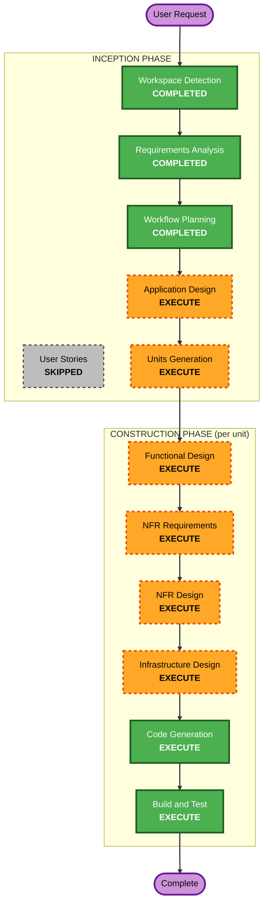

# Execution Plan

## Detailed Analysis Summary

### Project Context
- **Project Type**: Greenfield — Personal Context AI Assistant
- **Developer**: Single developer (sole builder and user)
- **Deployment**: Local Docker Compose, all data on-machine
- **Primary Challenge**: Temporal knowledge graph with hybrid retrieval and multi-step agent orchestration

### Change Impact Assessment
- **User-facing changes**: Yes — entire new API surface for conversation and memory
- **Structural changes**: Yes — new system architecture from scratch
- **Data model changes**: Yes — knowledge graph schema, conversation storage, temporal memory model
- **API changes**: Yes — all-new REST/WebSocket API
- **NFR impact**: Yes — provider abstraction, graceful degradation, data integrity

### Risk Assessment
- **Risk Level**: Medium-High
- **Primary Risk Factors**:
  - Novel memory architecture (temporal knowledge graph with belief history)
  - Framework maturity (Graphiti/LangGraph may have API instability)
  - Retrieval quality (hybrid retrieval is hard to get right)
- **Mitigation**: Evaluate frameworks before committing; keep abstractions thin; prioritize correctness over feature count
- **Rollback Complexity**: Low (greenfield, no production users)
- **Testing Complexity**: Moderate-High (memory correctness requires temporal scenario testing)

---

## Workflow Visualization

---

## Phases to Execute

### INCEPTION PHASE
- [x] Workspace Detection — COMPLETED
- [x] Reverse Engineering — SKIPPED (greenfield)
- [x] Requirements Analysis — COMPLETED
- [x] User Stories — SKIPPED (single developer, detailed requirements sufficient)
- [x] Workflow Planning — COMPLETED (this document)
- [ ] Application Design — **EXECUTE**
  - **Rationale**: Greenfield system with multiple components (API layer, orchestration, memory engine, knowledge graph, retrieval, provider abstraction). Component boundaries, interfaces, and dependencies must be defined before implementation.
- [ ] Units Generation — **EXECUTE**
  - **Rationale**: System decomposes into 5-7 distinct units of work with dependencies between them. Sequential build order matters (e.g., memory layer before orchestration, orchestration before API).

### CONSTRUCTION PHASE (per unit)
- [ ] Functional Design — **EXECUTE**
  - **Rationale**: Each unit has non-trivial data models, business logic, and interaction contracts. Memory correction semantics, temporal validity, and retrieval ranking all need detailed design.
- [ ] NFR Requirements — **EXECUTE**
  - **Rationale**: Provider abstraction, retry/fallback, data integrity constraints, and performance characteristics need assessment per unit.
- [ ] NFR Design — **EXECUTE**
  - **Rationale**: Resiliency baseline enabled; graceful degradation patterns, transaction boundaries, and observability need design.
- [ ] Infrastructure Design — **EXECUTE**
  - **Rationale**: Docker Compose with Neo4j + PostgreSQL + application services requires infrastructure-as-code definition, networking, volume persistence, and health checks.
- [ ] Code Generation — **EXECUTE** (always)
  - **Rationale**: Implementation planning and code generation for each unit.
- [ ] Build and Test — **EXECUTE** (always)
  - **Rationale**: Build verification, test execution, integration validation.

### OPERATIONS PHASE
- [ ] Operations — PLACEHOLDER (deferred)

---

## Estimated Construction Units (Preliminary)

Based on requirements analysis, the system likely decomposes into these units (to be finalized in Units Generation):

| Unit | Description | Key Dependencies |
|------|-------------|-----------------|
| 1. Foundation & Data Layer | PostgreSQL schema, Neo4j setup, base models, configuration | None |
| 2. LLM Provider Abstraction | Multi-provider interface, Gemini/OpenAI/Anthropic adapters | Foundation |
| 3. Memory Engine | Knowledge graph operations, temporal facts, entity management, Graphiti integration | Foundation, Provider |
| 4. Retrieval & Context Construction | Hybrid retrieval, reranking, context assembly | Memory Engine, Provider |
| 5. Agent Orchestration | LangGraph workflows (conversation, extraction, correction, historical, ambiguous) | All above |
| 6. API Layer | FastAPI endpoints (conversation, memory inspection, management, import/export) | Orchestration |
| 7. Infrastructure & Deployment | Docker Compose, health checks, backup/restore | All |

**Build order**: Sequential with units building on prior foundations.

---

## Success Criteria (Execution Plan Level)
- **Primary Goal**: Prove the core hypothesis — longitudinal context retrieval works correctly
- **Key Deliverables**: Working local system with all 7 units integrated
- **Quality Gates**: 
  - Each unit passes its own tests
  - Integration test: store fact → intervening conversations → retrieve correctly
  - Temporal test: handle supersession and "what was true at time T?"
  - Correction test: correct memory → future responses respect correction
  - Full system: `docker-compose up` → functional API

---
